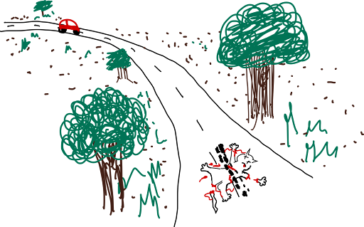
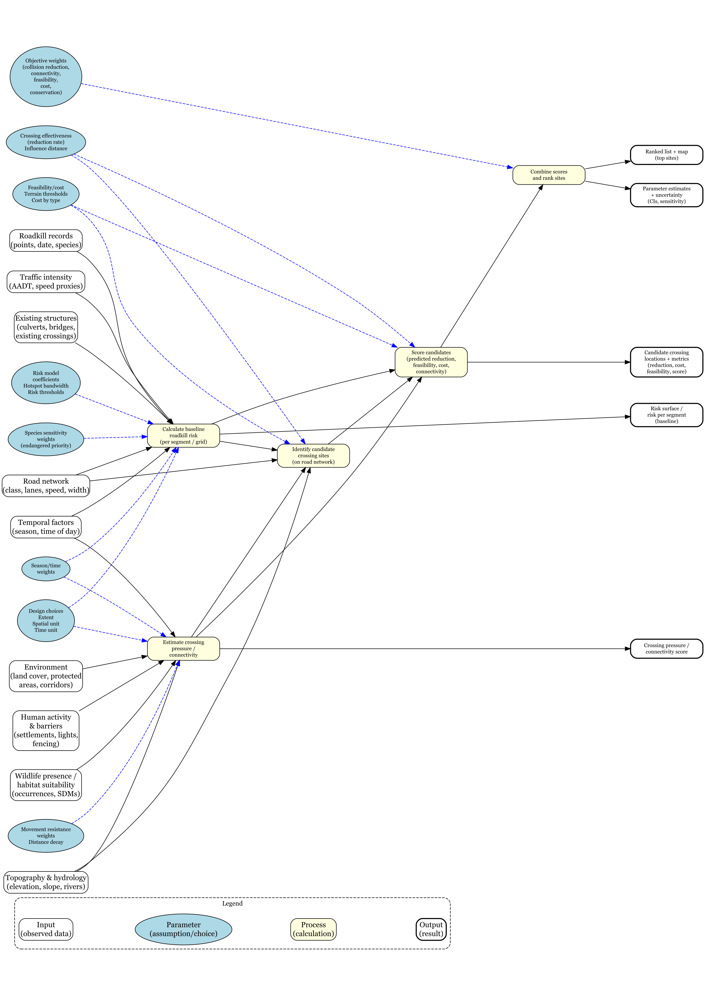

# 1. Modeling goal and goal type

**Modeling goal:** The modeling goal addresses an environmental challenge by predicting and communicating where wildlife crossings should be established based on the concentration of roadkill incidents in specific areas. The model identifies optimal locations for wildlife crossings along road networks by analyzing roadkill data alongside relevant environmental and roadway characteristics. By highlighting areas with frequent wildlife-vehicle collisions, the model supports evidence-based decisions on where to construct wildlife underpasses or overpasses, ultimately reducing wildlife mortality, improving driver safety, and supporting long-term ecological sustainability.

**Goal type:** Prediction (primary) and communication (secondary).

# 2. Context

Road networks fragment natural habitats, forcing wildlife to cross roads when moving between feeding grounds, breeding areas, and seasonal migration routes. These crossings can result in wildlife-vehicle collisions that threaten wildlife populations, especially endangered species and those with low reproductive rates. Wildlife crossings can reduce collisions, but they are expensive, so agencies must prioritize where to place them.

Roadkill incidents tend to cluster where roads intersect important habitats or movement corridors (for example, forests, protected areas, and national parks). This model analyzes those patterns and turns raw data into clear information to guide environmental planning and infrastructure investment.

# 3. Inputs, parameters, and outputs

## Inputs

- Georeferenced wildlife roadkill records (points with date and species when available).
- Road network characteristics (geometry, class, lanes, surface, width, posted speed limits).
- Traffic intensity (AADT or proxy measures of traffic volume and vehicle speed).
- Environmental and landscape features (land cover, proximity to forests/wetlands/protected areas, known corridors).
- Topography and hydrology (elevation, slope, proximity to rivers/streams).
- Wildlife presence and habitat suitability (occurrences, habitat maps, species distribution models).
- Temporal factors (seasonal patterns and time of day when available).
- Human activity and barriers (settlements, night-time lights, fencing, other barriers).
- Existing crossing structures (culverts, bridges, existing wildlife crossings when available).
- **Explicit design choices:** spatial extent = tropical/subtropical/mediterranean; spatial unit = road segments (250 m or 1 km) and/or raster grids (100 m); time unit = annual or seasonal.

## Parameters

- **Roadkill risk model:** coefficients linking predictors (traffic, speed, road type, habitat) to collision probability; hotspot bandwidth; risk thresholds.
- **Wildlife movement and crossing pressure:** resistance weights for land cover; distance-decay from suitable habitat or corridors; weights for feeding/breeding/migration features.
- **Species sensitivity:** higher weighting for endangered, threatened, or keystone species.
- **Temporal parameters:** seasonal/time-based weights (migration, breeding, nocturnal movement).
- **Crossing effectiveness:** expected reduction near crossings by type; influence distance along road (for example, plus or minus 500 m).
- **Feasibility and cost:** construction constraints (slope/terrain thresholds); relative cost by crossing type.
- **Objective weighting:** weights across collision reduction, connectivity, feasibility, cost, and conservation priority.

## Outputs

1. Roadkill risk surface or risk per road segment (baseline, before crossings).
2. Connectivity or crossing pressure score (where animals are most likely to attempt crossing).
3. Candidate crossing locations with predicted roadkill reduction, cost/feasibility score, and final combined priority score.
4. Ranked list and map of top sites (for example, top 25 with coordinates and road references).
5. Statistical reporting (for example, parameter estimates and confidence intervals).

# 4. Conceptual model diagram

```{r}
library(DiagrammeR)
library(DiagrammeRsvg)
library(rsvg)

g <- grViz("
digraph conceptual_model {
  graph [layout = dot, rankdir = LR, ranksep = 1.2, nodesep = 0.5]

  # Legend
  subgraph cluster_legend {
    label = 'Legend';
    style = 'rounded,dashed';
    fontsize = 12;

    node [shape = box, style = rounded, fillcolor = white]
    leg_input [label='Input\n(observed data)']

    node [shape = ellipse, style = filled, fillcolor = lightblue]
    leg_param [label='Parameter\n(assumption/choice)']

    node [shape = box, style = 'rounded,filled', fillcolor = lightyellow]
    leg_process [label='Process\n(calculation)']

    node [shape = box, style = 'rounded,bold', fillcolor = lightgreen]
    leg_output [label='Output\n(result)']

    leg_input -> leg_param [style=invis]
    leg_param -> leg_process [style=invis]
    leg_process -> leg_output [style=invis]
  }

  # Inputs
  node [shape = box, style = rounded, fillcolor = white]
  roadkill   [label='Roadkill records\n(points, date, species)']
  roads      [label='Road network\n(class, lanes, speed, width)']
  traffic    [label='Traffic intensity\n(AADT, speed proxies)']
  env        [label='Environment\n(land cover, protected\nareas, corridors)']
  topo       [label='Topography & hydrology\n(elevation, slope, rivers)']
  human      [label='Human activity\n& barriers\n(settlements, lights,\nfencing)']
  existing   [label='Existing structures\n(culverts, bridges,\nexisting crossings)']
  habitat    [label='Wildlife presence /\nhabitat suitability\n(occurrences, SDMs)']
  temporal   [label='Temporal factors\n(season, time of day)']

  # Parameters (assumptions / choices)
  node [shape = ellipse, style = filled, fillcolor = lightblue, fontsize = 10]
  param_risk     [label='Risk model\ncoefficients\nHotspot bandwidth\nRisk thresholds']
  param_pressure [label='Movement resistance\nweights\nDistance decay']
  param_species  [label='Species sensitivity\nweights\n(endangered priority)']
  param_temporal [label='Season/time\nweights']
  param_eff      [label='Crossing effectiveness\n(reduction rate)\nInfluence distance']
  param_feas     [label='Feasibility/cost\nTerrain thresholds\nCost by type']
  param_design   [label='Design choices\nExtent\nSpatial unit\nTime unit']
  param_weights  [label='Objective weights\n(collision reduction,\nconnectivity,\nfeasibility,\ncost,\nconservation)']

  # Processes
  node [shape = box, style = 'rounded,filled', fillcolor = lightyellow, width = 1.9]
  calc_risk      [label='Calculate baseline\nroadkill risk\n(per segment / grid)']
  calc_pressure  [label='Estimate crossing\npressure /\nconnectivity']
  identify       [label='Identify candidate\ncrossing sites\n(on road network)']
  score_sites    [label='Score candidates\n(predicted reduction,\nfeasibility, cost,\nconnectivity)']
  rank_sites     [label='Combine scores\nand rank sites']

  # Outputs
  node [shape = box, style = 'rounded,bold', fillcolor = lightgreen]
  riskmap   [label='Risk surface /\nrisk per segment\n(baseline)']
  pressure  [label='Crossing pressure /\nconnectivity score']
  candidates [label='Candidate crossing\nlocations + metrics\n(reduction, cost,\nfeasibility, score)']
  ranked    [label='Ranked list + map\n(top sites)']
  stats     [label='Parameter estimates\n+ uncertainty\n(CIs, sensitivity)']

  # --- Wiring: inputs -> processes ---
  roadkill -> calc_risk
  roads    -> calc_risk
  traffic  -> calc_risk
  existing -> calc_risk
  temporal -> calc_risk

  env     -> calc_pressure
  topo    -> calc_pressure
  human   -> calc_pressure
  habitat -> calc_pressure
  temporal -> calc_pressure

  # --- Parameters -> processes (dashed) ---
  param_risk     -> calc_risk     [style=dashed, color=blue]
  param_species  -> calc_risk     [style=dashed, color=blue]
  param_temporal -> calc_risk     [style=dashed, color=blue]
  param_pressure -> calc_pressure [style=dashed, color=blue]
  param_temporal -> calc_pressure [style=dashed, color=blue]
  param_design   -> calc_risk     [style=dashed, color=blue]
  param_design   -> calc_pressure [style=dashed, color=blue]

  # --- Processes -> candidate identification ---
  calc_risk     -> identify
  calc_pressure -> identify
  roads         -> identify
  topo          -> identify

  param_feas -> identify [style=dashed, color=blue]
  param_eff  -> identify [style=dashed, color=blue]

  # --- Candidate scoring + ranking ---
  identify     -> score_sites
  calc_risk    -> score_sites
  calc_pressure -> score_sites
  param_eff    -> score_sites [style=dashed, color=blue]
  param_feas   -> score_sites [style=dashed, color=blue]
  param_weights -> rank_sites [style=dashed, color=blue]

  score_sites -> rank_sites

  # --- Outputs ---
  calc_risk     -> riskmap
  calc_pressure -> pressure
  score_sites   -> candidates
  rank_sites    -> ranked
  rank_sites    -> stats

  # Layout hints (keep columns aligned)
  {rank=same; roadkill; roads; traffic; existing; env; topo; human; habitat; temporal}
  {rank=same; param_risk; param_pressure; param_species; param_temporal; param_eff; param_feas; param_design; param_weights}
  {rank=same; calc_risk; calc_pressure}
  {rank=same; identify}
  {rank=same; score_sites}
  {rank=same; rank_sites}
  {rank=same; riskmap; pressure; candidates; ranked; stats}
}
")


# Save as PNG
svg <- export_svg(g)
writeLines(svg, "conceptual_model.svg")
rsvg_png("conceptual_model.svg", "conceptual_model.png", width = 2400, height = 3400)


```


