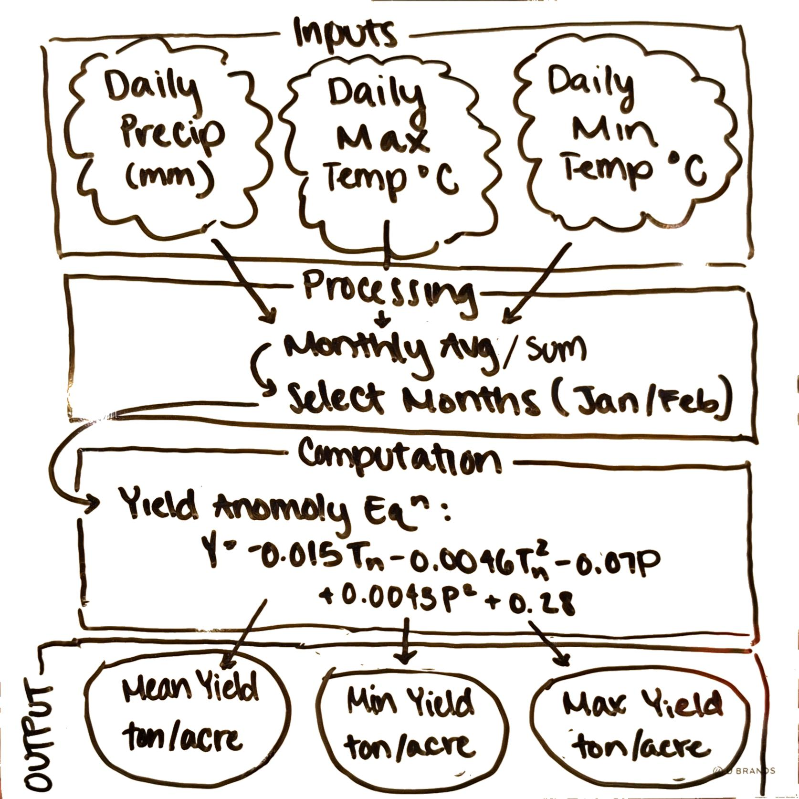

## Conceptual Model



### Load Required Libraries and Data

```{r}
#| message: false

library(tidyverse)

raw_data <-read_delim("../../Data/clim.txt", delim = " ")
```

### Run Almond Yield Model

```{r}
#| warning: false
#| message: false

source("Assignment3_YieldFun.R")

yield_anomalies <- almond_yield(raw_data)

  list(
    max_yield_anomaly = max(yield_anomalies$yield, na.rm = TRUE),
    min_yield_anomaly = min(yield_anomalies$yield, na.rm = TRUE),
    mean_yield_anomaly = mean(yield_anomalies$yield, na.rm = TRUE)
  )


```
